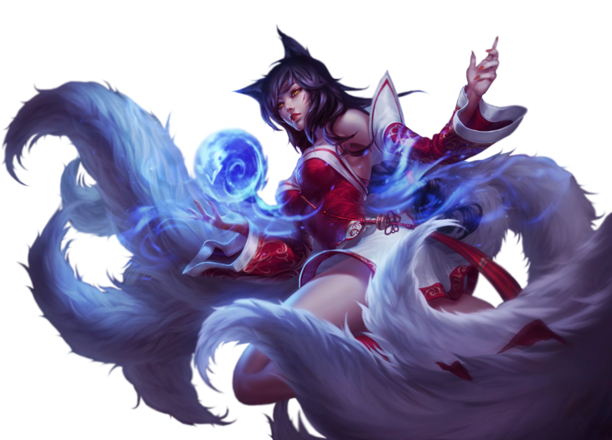
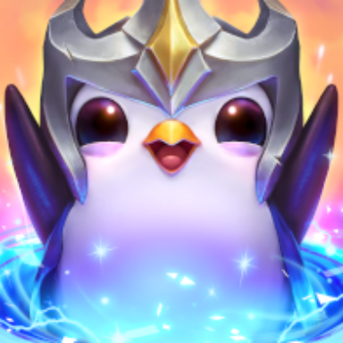

## Hi, I'm Kashif 👋

I'm a software engineer with a passion for game and full-stack development. I've worked on League of Legends, Teamfight Tactics, Roblox, War Dragons, and developed Stanford University's current "Paperless" platform.

## About Me
- 🔭 **Working:** at [Riot Games](https://github.com/RiotGames) on the Hextech Engine, the game engine behind League and TFT.
- 🌱 **Learning:** how to integrate AI into game development workflows.
- 💬 **Ask me:** about game, game engine, and full-stack development.
- ❌ **Don't ask me:** about why everything is, in fact, a minion.
- 😄 **Pronouns:** He/Him

## Skills

### Programming Languages

### Frameworks & Libraries

### Game Development

### Tools & Platforms

## Games
<table>
  <tr>
    <td align="center">
      <a href="https://www.leagueoflegends.com/">
         
      </a>
      <b>League of Legends</b>
    </td>
    <td align="center">
      <a href="https://www.teamfighttactics.com/">
         
      </a>
      <b>Teamfight Tactics</b>
    </td>
    <td align="center">
      <a href="https://www.pocketgems.com/">
         
      </a>
      <b>Adventure Chef</b>
    </td>
    <td align="center">
      <a href="https://www.pocketgems.com/">
         
      </a>
      <b>Merge Tower Defense</b>
    </td>
    <td align="center">
      <a href="https://www.wardragons.com/">
         
      </a>
      <b>War Dragons</b>
    </td>
    <td align="center">
      <a href="https://www.roblox.com/">
         
      </a>
      <b>Roblox</b>
    </td>
  </tr>
</table>

## Projects
<table>
  <tr>
    <td align="center">
      <a href="https://github.com/knazir/SeePlusPlus">
            
      </a>
      <b>See++</b>
    </td>
    <td align="center">
      <a href="https://cs198.stanford.edu/paperless">
         
      </a>
      <b>Paperless</b>
    </td>
  </tr>
</table>
